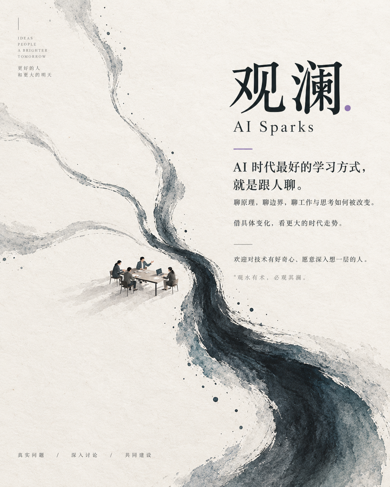

# AI Sparks · 观澜

**AI 时代最好的学习方式，就是跟人聊。**

借具体变化，看更大的时代走势。

围绕真实的问题，把不同人的经验和判断放在一起碰撞。聊技术背后的原理，聊 AI 的能力与边界，也聊它正在怎样改变工作、产品、组织和思考方式。

真实问题 · 深入讨论 · 彼此校正 · 共同建设

<a href="https://zhong-ze-wei.github.io/ai-spark/"></a>

## 在线阅读

**[打开观澜首页 →](https://zhong-ze-wei.github.io/ai-spark/)**

主要服务没时间刷群的朋友：先挑一个值得看的问题，再读不同意见与完整分析。首页保持简短，深入阅读时仍能找到完整内容。

- [话题追踪](https://zhong-ze-wei.github.io/ai-spark/topics/)：七个分类、38 个话题，每篇都有独立链接。
- [人物发言](https://zhong-ze-wei.github.io/ai-spark/people/)：按昵称与日期找到相关观点。
- [完整档案](https://zhong-ze-wei.github.io/ai-spark/archive/)：分歧、事件、原话、阅读路线与长文存档。
- [继续讨论的问题](https://zhong-ze-wei.github.io/ai-spark/questions/)：查看未解决的问题与后续方向。
- [从思考到工具](https://zhong-ze-wei.github.io/ai-spark/skills/)：阅读理念及 temper、aptum 的实践。
- [群公告与共享资源](https://zhong-ze-wei.github.io/ai-spark/community/)：工具表、API 入口、求职与内推信息。

网页整理了 2026 年 7 月 12 日至 9 月 15 日的讨论，包含 38 个主题、28 个事件、20 场分歧与 177 段原话，支持搜索、主题导航和深浅色切换。

## 为什么叫“观澜”

“观水有术，必观其澜。”——[《孟子·尽心上》](https://ctext.org/text.pl?if=gb&node=1815&show=parallel)

一个模型更新、一次工作提效、一段失败的尝试，都可以成为讨论的起点。我们借“观澜”这个意象表达自己的主张：沿着具体变化继续追问它的原因、影响，以及哪些判断需要重新检验。

我们不一定是专家。希望这里聚集的是一群对技术有好奇心、愿意多想一层的人：观察变化、提出问题、交换经验、彼此修正判断，也尽可能亲手参与和建设这个时代。

欢迎讨论，也欢迎邀请新的朋友加入。视角越多，碰撞越多。[阅读完整群公告与资源说明](docs/community.md)。

实践卡是基于讨论整理的建议，尚未代表群内已经完成的实验。带着真实任务、失败案例或不同意见来，可以让下一次讨论更具体。

## 从思考到工具

**[阅读：从思考到工具 →](https://zhong-ze-wei.github.io/ai-spark/skills/)**

《AI Sparks 蒸馏声明》把人的注意力放在目标、上下文、判断、验证和责任上；《当「会做事」不再稀缺》继续追问：执行成本下降后，什么仍然值得积累？

我把这些问题延伸成两项实践：让反馈真正进入下一轮工作，让表达真正接上眼前的读者。

| 我的 Skill | 从哪个问题出发 | 项目与使用说明 |
| --- | --- | --- |
| **temper · 淬炼** | 每轮拿什么验证，人在哪里参与，反馈怎样改变下一轮？将复杂任务组织成可执行、可交接的人机协作循环。 | [查看项目与安装说明](https://github.com/Zhong-Ze-Wei/temper) |
| **aptum** | 这个读者要理解或完成什么，缺少哪些背景？让 AI 调整解释深度与表达方式，同时保留关键事实和边界。 | [查看项目与安装说明](https://github.com/Zhong-Ze-Wei/aptum) |

这些是整理者的延伸实践，不代表全体群成员的共同立场。两个 Skill 在独立仓库持续维护，此处提供统一阅读入口。

## 阅读材料

| 材料 | 内容 |
| --- | --- |
| [AI Sparks 蒸馏声明（PDF）](materials/distillation-statement.pdf) | 从群聊提炼问题定义、业务认知、反馈、判断与责任。 |
| [当「会做事」不再稀缺（PDF）](materials/when-doing-is-no-longer-scarce.pdf) | 围绕执行成本下降，思考工作、信任和人的价值。 |

## 如何理解这些材料

这些内容是群聊整理、个人观点与 AI 辅助分析，保留了讨论发生时的语境。模型体验、趋势判断和整理者的推演不等同于经过独立核实的事实，也不代表所有群成员的共同立场。

如发现涉敏内容，请及时私聊群主或反馈给整理者，并提供对应页面和段落。普通纠错可以在 [Issues](https://github.com/Zhong-Ze-Wei/ai-spark/issues) 提出；涉及隐私的原文请通过私下渠道反馈。

## 项目结构

- `index.html`：精选首页。
- `topics/`、`categories/`、`people/`、`debates/`、`events/`、`sources/`：生成的独立阅读页面；完整正文不依赖 JavaScript。
- `content/`：保留的结构化资料、既有正文与首页精选配置。
- `scripts/build.py`：用 Python 标准库生成静态页面。
- `scripts/check.py`：核对所有本地链接、内容数量及 177 段原话的一致性。
- `assets/site/`：共用样式、搜索、收藏、字号及主题切换。
- `assets/guanlan-theme.png`：群主题图，随网页一起保存可显示完整封面。
- `assets/guanlan-invitation.png`：加群邀请卡；原始二维码另存，需按有效期更新。
- `archive.html`：改版前的七章长文存档，保留原有完整措辞。
- `docs/community.md`：群公告与共享资源，更新于 2026 年 9 月 17 日。
- `materials/`：补充阅读材料。

网页由 GitHub Pages 发布。仓库 `main` 分支更新后会自动重新部署；在线地址保持不变。

维护时先更新 `content/` 中的内容，再运行：

```sh
python3 scripts/build.py
python3 scripts/check.py
python3 -m http.server 8768
```

旧的 `#topic/t19`、`#person/p01` 等定位会转到对应新页面；`#read` 转到话题入口。参见 [本轮改版说明](docs/reading-structure.md)。
